<div align="center">

# 🛍️ E-Store

**A full-featured mobile e-commerce app built with React Native & Expo**

[](https://reactnative.dev/)
[](https://expo.dev/)
[](https://firebase.google.com/)
[](https://developer.mozilla.org/en-US/docs/Web/JavaScript)

_Your everyday store — shop anytime, anywhere._

</div>

---

## 📱 Overview

E-Store is a cross-platform mobile shopping application that provides a seamless e-commerce experience. Users can browse products, manage a cart, authenticate securely, and track their orders — all from a clean, modern interface.

---

## ✨ Features

- 🔐 **Authentication** — Signup, Login, OTP Verification, Forgot Password & Reset Password via Firebase Auth
- 🏠 **Home Feed** — Browse all products with live search, powered by DummyJSON API
- 🗂️ **Categories** — Filter and explore products by category
- 🛒 **Cart** — Add/remove items, persistent cart using AsyncStorage
- 📦 **Product Details** — Detailed product view with images, ratings, and descriptions
- 👤 **Profile** — View and edit user profile
- ✅ **Order Success Screen** — Confirmation screen after placing an order
- 🌊 **Animated Splash Screen** — Smooth spring animation on app launch

---

## 🗂️ Project Structure

```
E_Store/
├── app/
│   ├── (auth)/                  # Auth screens (file-based routing)
│   │   ├── login.js
│   │   ├── signup.js
│   │   ├── verify-otp.js
│   │   ├── forgot-password.js
│   │   ├── reset-password.js
│   │   ├── password-success.js
│   │   └── _layout.js
│   ├── (tabs)/                  # Bottom tab screens
│   │   ├── home.js
│   │   ├── categories.js
│   │   ├── cart.js
│   │   ├── profile.js
│   │   └── _layout.js
│   ├── index.js                 # Splash screen & auth redirect
│   ├── product-detail.js
│   ├── edit-profile.js
│   ├── OrderSuccessScreen.js
│   └── _layout.js               # Root layout with providers
├── components/
│   ├── ProductCard.js
│   └── CartItem.js
├── config/
│   └── firebase.js              # Firebase initialization
├── context/
│   ├── AuthContext.js           # Auth state management
│   └── CartContext.js           # Cart state management
├── utils/
│   └── cartStorage.js           # AsyncStorage helpers
└── assets/
    └── images/
```

---

## 🛠️ Tech Stack

| Layer          | Technology                          |
| -------------- | ----------------------------------- |
| Framework      | React Native (Expo)                 |
| Routing        | Expo Router (file-based)            |
| Backend / Auth | Firebase (Auth + Realtime Database) |
| Products API   | [DummyJSON](https://dummyjson.com/) |
| Local Storage  | AsyncStorage                        |
| Icons          | Expo Vector Icons (Ionicons)        |

---

## 🚀 Getting Started

### Prerequisites

- Node.js `>= 18`
- npm or yarn
- Expo CLI (`npm install -g expo-cli`)
- Expo Go app on your phone (for testing) OR an Android/iOS emulator

### Installation

1. **Clone the repository**

   ```bash
   git clone https://github.com/your-username/E_Store.git
   cd E_Store
   ```

2. **Install dependencies**

   ```bash
   npm install
   ```

3. **Configure Firebase**

   Create your Firebase project at [console.firebase.google.com](https://console.firebase.google.com), then update `config/firebase.js` with your own credentials:

   ```js
   const firebaseConfig = {
     apiKey: "YOUR_API_KEY",
     authDomain: "YOUR_AUTH_DOMAIN",
     databaseURL: "YOUR_DATABASE_URL",
     projectId: "YOUR_PROJECT_ID",
     storageBucket: "YOUR_STORAGE_BUCKET",
     messagingSenderId: "YOUR_MESSAGING_SENDER_ID",
     appId: "YOUR_APP_ID",
   };
   ```

   > ⚠️ **Never commit your real Firebase credentials to a public repo.** Use environment variables or a `.env` file.

4. **Start the development server**

   ```bash
   npx expo start
   ```

5. **Run on device**
   - Scan the QR code with **Expo Go** (Android/iOS)
   - Or press `a` for Android emulator, `i` for iOS simulator

---

## 🔒 Environment Variables

It is recommended to store Firebase secrets in a `.env` file:

```
EXPO_PUBLIC_FIREBASE_API_KEY=your_api_key
EXPO_PUBLIC_FIREBASE_AUTH_DOMAIN=your_auth_domain
...
```

Add `.env` to your `.gitignore`:

```
.env
```

---

## 📸 App Screenshots

<div align="center">

|                       Splash Screen                        |                    Login Screen                     |                    Register Screen                     |
| :--------------------------------------------------------: | :-------------------------------------------------: | :----------------------------------------------------: |
| 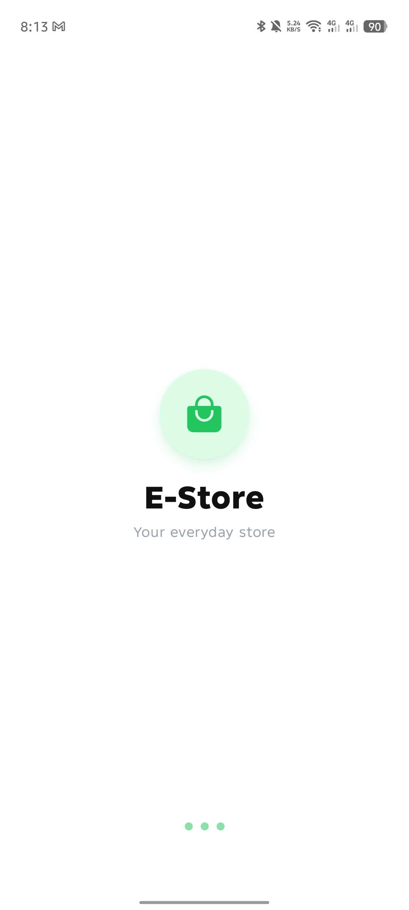 | 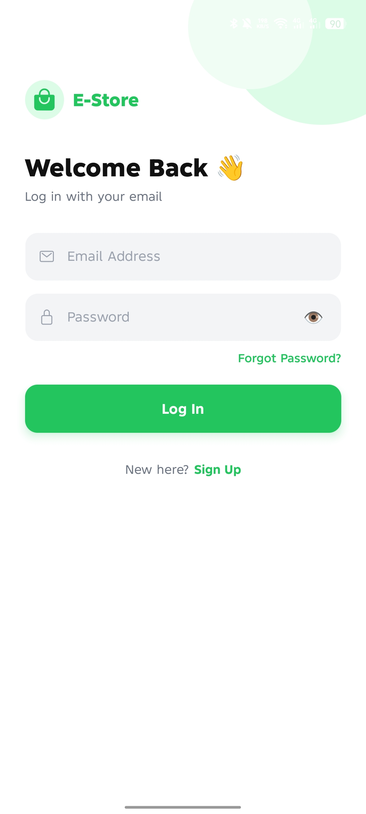 | 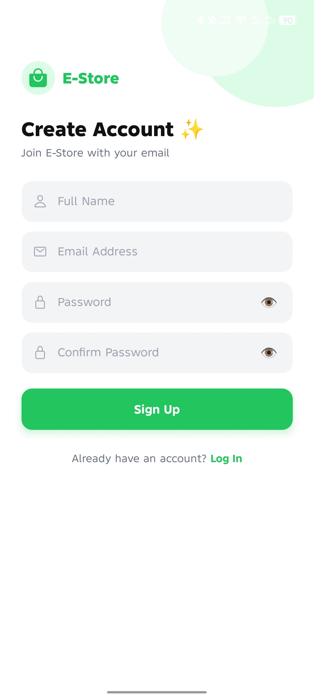 |

|                    Home Screen                     |                        Categories                        |                       Product Details                        |
| :------------------------------------------------: | :------------------------------------------------------: | :----------------------------------------------------------: |
| 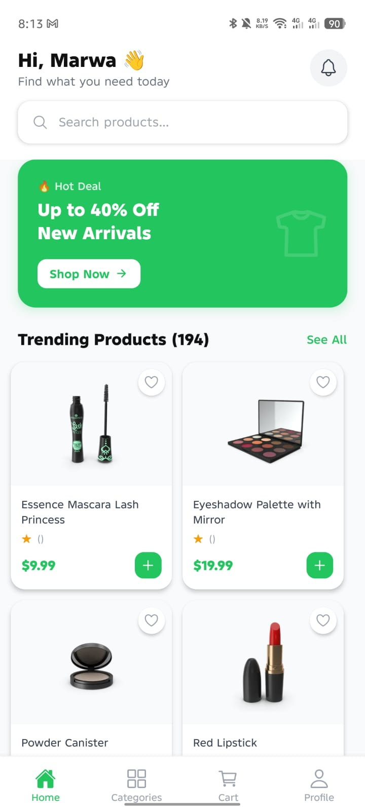 | 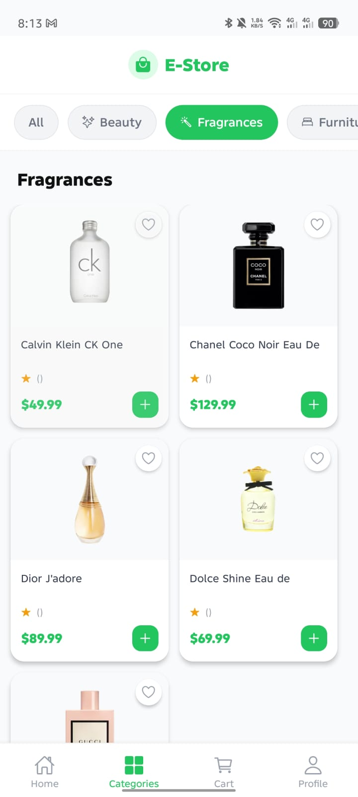 | 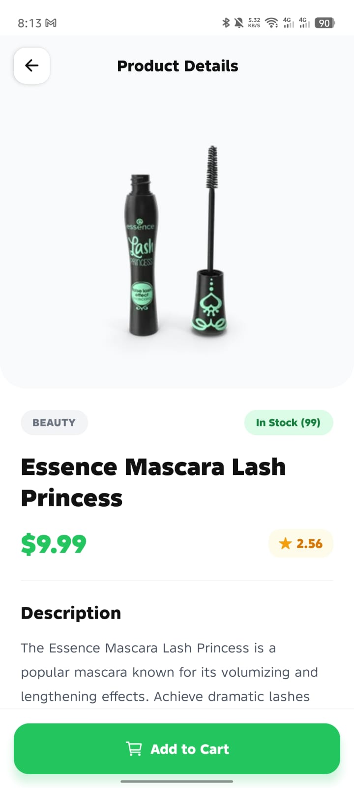 |

|                    Cart Screen                     |                    Profile Screen                     |                       Add to Cart                       |
| :------------------------------------------------: | :---------------------------------------------------: | :-----------------------------------------------------: |
| 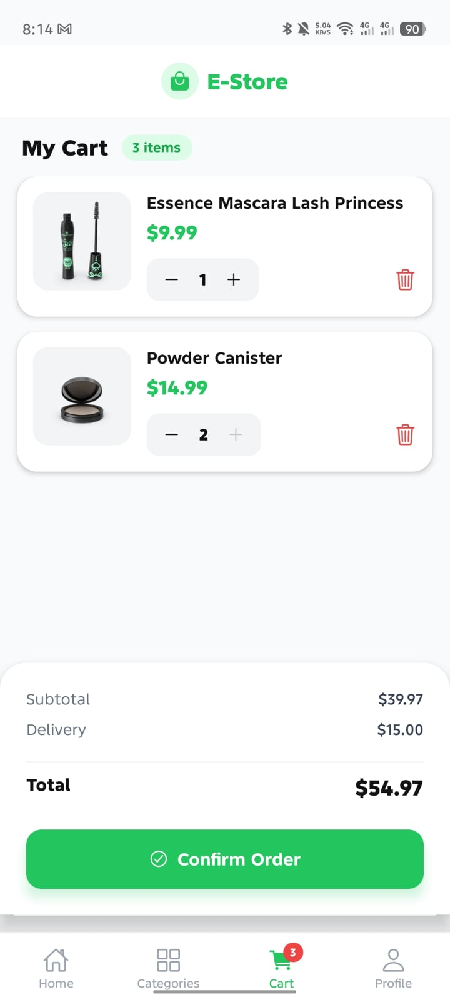 | 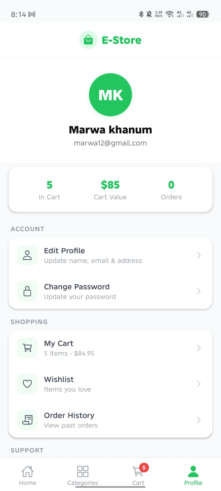 | 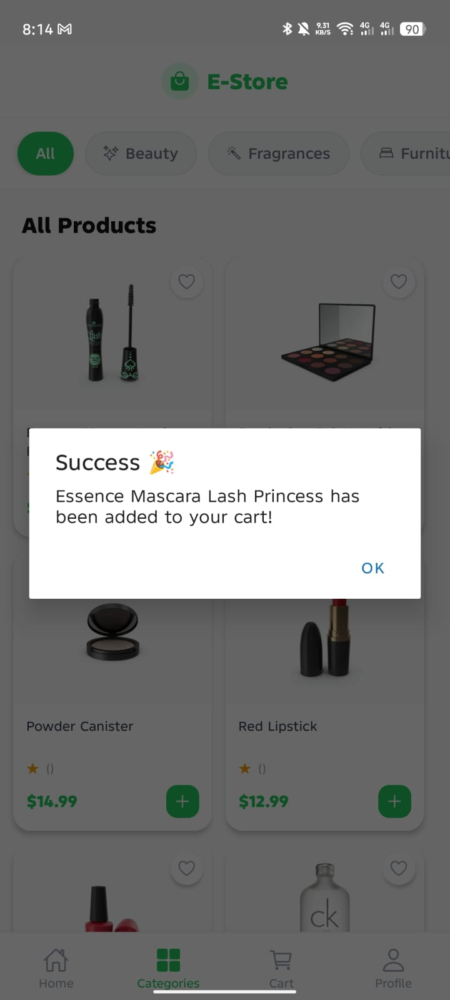 |

|                    Update Profile                    |                        Logout                        |
| :--------------------------------------------------: | :--------------------------------------------------: |
| 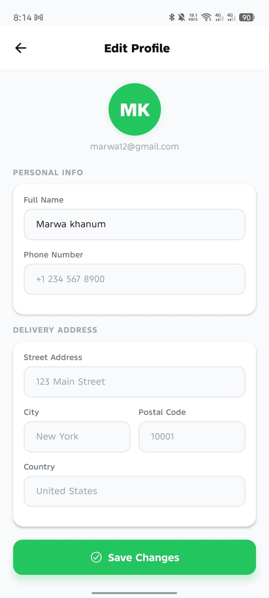 | 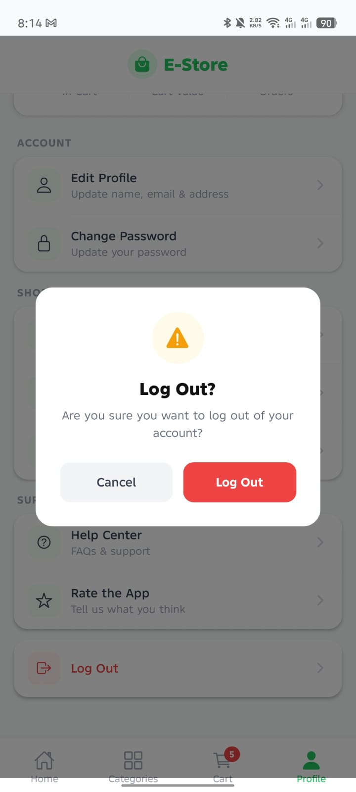 |

</div>
## 🤝 Contributing

Pull requests are welcome! For major changes, please open an issue first to discuss what you'd like to change.

1. Fork the repo
2. Create your feature branch: `git checkout -b feature/my-feature`
3. Commit your changes: `git commit -m 'Add my feature'`
4. Push to the branch: `git push origin feature/my-feature`
5. Open a Pull Request

---

## 📄 License

This project is licensed under the [MIT License](LICENSE).

---

<div align="center">
Made with ❤️ using React Native & Expo
</div>
